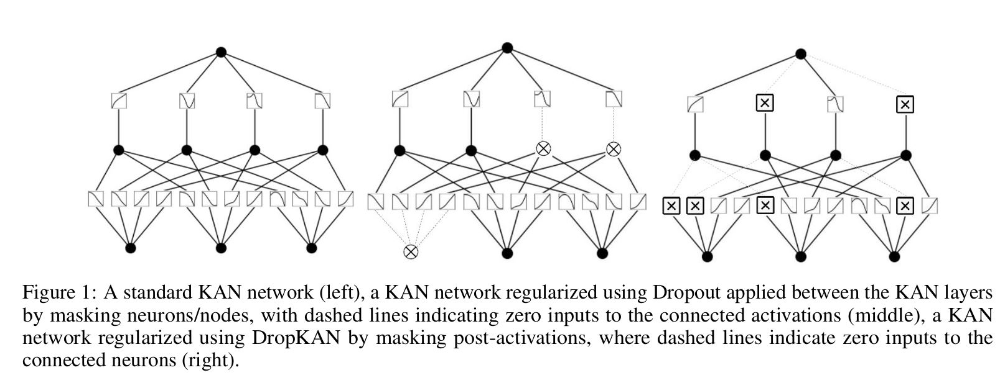

This is the GitHub repository for the papers:  
["DropKAN: Regularizing KANs by masking post-activations"](https://arxiv.org/abs/2407.13044) and  
["Rethinking the Function of Neurons in KANs"](https://arxiv.org/abs/2407.20667).

# Dropout Kolmogorov-Arnold Networks (DropKAN)

DropKAN operates by randomly masking some of the post-activations within the KANs computation graph, while scaling-up the retained post-activations.

## How to use

The DropKAN model can be used similarly to KAN to create a model of DropKANLayers. Three parameters are needed with DropKAN:

- **drop_rate**: You can provide a single float value (e.g., `0.1`) which will apply the same dropout rate to all layers, or a list of floats (e.g., `[0.1, 0.2]`) to specify per-layer rates.
- **drop_mode**: Accepts `'postspline'` (drop mask applied to the layer's postsplines), `'postact'` (drop mask applied to post-activations), `'dropout'` (standard dropout applied to inputs). Default is `'postact'`.
- **drop_scale**: If `True`, retained activations are scaled by `1/(1-drop_rate)`. Default is `True`.

## Quick start example

```python
from dropkan.DropKAN import DropKAN
import torch
from sklearn.datasets import fetch_openml
from sklearn.model_selection import train_test_split
from sklearn.preprocessing import StandardScaler
from sklearn.metrics import mean_absolute_error

def set_training_mode(module, mode):
    """Set the training mode for a module and all its sub-modules."""
    module.training = mode
    for submodule in module.children():
        set_training_mode(submodule, mode)

# Load dataset
wine_quality = fetch_openml(name='wine-quality-red', version=1)
X = wine_quality.data
y = wine_quality.target.astype(float)

# Train/test split
X_train, X_test, y_train, y_test = train_test_split(X, y, test_size=0.4, random_state=42)

# Scaling
scaler = StandardScaler()
X_train = scaler.fit_transform(X_train)
X_test = scaler.transform(X_test)

# Prepare dataset dictionary with torch tensors
dataset = {
    'train_input': torch.from_numpy(X_train).float(),
    'test_input': torch.from_numpy(X_test).float(),
    'train_label': torch.from_numpy(y_train.values).float(),
    'test_label': torch.from_numpy(y_test.values).float()
}

# Initialize model
model = DropKAN(seed=0, width=[X_train.shape[1], X_train.shape[1]*2, 1], drop_rate=0.1, drop_mode='postact')

# Train
model.train(dataset, opt="Adam", steps=1000, batch=32, lr=0.01, loss_fn=torch.nn.L1Loss())

# Evaluation
set_training_mode(model, False)

y_pred = model(dataset['test_input']).detach().numpy()
mae = mean_absolute_error(y_test, y_pred)
print(f"mode=DropKAN | test={mae:.4f}")


```
## Citation
```python
@article{altarabichi2024dropkan,
  title={Dropkan: Regularizing kans by masking post-activations},
  author={Altarabichi, Mohammed Ghaith},
  journal={arXiv preprint arXiv:2407.13044},
  year={2024}
}
```

## Contact
If you have any questions, please contact mohammed_ghaith.altarabichi@hh.se
